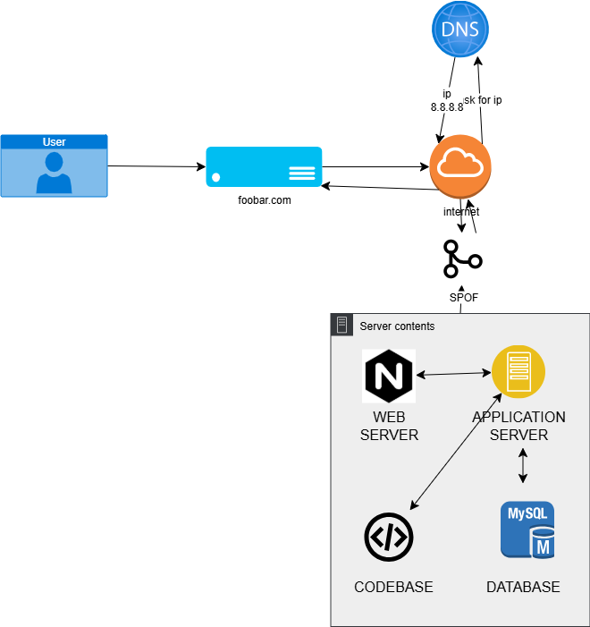

# Web Infrastructure Design Project

This project documents the process of designing a web infrastructure, starting from a simple single-server setup to a scalable, secured, and monitored multi-server architecture. Each task represents an evolution of the infrastructure to solve the problems of the previous stage.

---

## Task 0: Simple Web Stack

This initial setup represents the most basic infrastructure for a dynamic website, where all components reside on a single server.

### Key Issues Explained:
* **Single Point of Failure (SPOF):** If this one server fails, the entire website goes down.
* **Downtime During Maintenance:** Deploying new code or performing updates requires restarting services, causing downtime for users.
* **Inability to Scale:** The server has finite resources and cannot handle traffic spikes, leading to slow performance or crashes.

---

## Task 1: Distributed Web Infrastructure

To address the issues of the simple stack, we introduce redundancy and load distribution.

### Improvements Explained:
* **Load Balancer (HAproxy):** Distributes incoming traffic across multiple servers, preventing any single server from being overwhelmed.
* **Multiple Servers:** Provides redundancy. If one server fails, the other can continue to handle traffic.
* **Database Replication (Primary-Replica):** The Primary database handles all write operations, while the Replica handles read operations, distributing the database load.

### New Issues Introduced:
* **New SPOFs:** The load balancer and the Primary database are now single points of failure.
* **Security:** The infrastructure lacks firewalls, and traffic is not encrypted (no HTTPS).
* **Monitoring:** There is no system in place to monitor the health and performance of the servers.

---

## Task 2: Secured and Monitored Web Infrastructure

This stage adds crucial security and monitoring layers to the distributed setup.

### Improvements Explained:
* **Firewalls:** Deployed to filter traffic and block malicious requests.
* **SSL Certificate (HTTPS):** Encrypts traffic between the user and our infrastructure, protecting user data.
* **Monitoring Clients:** Collect data on server performance (CPU, memory, traffic), allowing for proactive problem-solving.

### Remaining Issues:
* **SSL Termination:** Traffic between the load balancer and the web servers is unencrypted.
* **Single Point of Failure for Writes:** The Primary database is still the only server that can handle write operations.
* **Resource Contention:** Web, application, and database services compete for resources on the same server.

---

## Task 3: Scaled-Up Infrastructure

The final design achieves high availability and true scalability by separating components into dedicated tiers.

### Final Architecture Explained:
* **High-Availability Load Balancer:** A second load balancer is added in a cluster to eliminate it as a SPOF.
* **Component Separation (Tiers):**
    * **Web Server Tier:** A set of servers dedicated to serving static content.
    * **Application Server Tier:** A set of servers dedicated to running the application logic.
    * **Database Tier:** A dedicated database cluster.
* **Benefits:** This separation allows for independent scaling of each tier based on specific needs and isolates failures, creating a robust and highly available system.

---

## Web Server vs. Application Server

As required by the project, here is an explanation of the difference between a web server and an application server.

### Web Server
A **web server's** primary job is to handle HTTP/HTTPS requests and serve **static content**. This includes files that don't change, such as HTML, CSS, JavaScript, and images. It acts as the "front door" for the infrastructure.
* **Examples:** Nginx, Apache.

### Application Server
An **application server's** primary job is to execute **dynamic business logic**. It provides a runtime environment for application code, processes complex user requests, and interacts with databases and other services to generate dynamic content. It's the "brain" of the application.
* **Examples:** Gunicorn (for Python), PM2 (for Node.js), Tomcat (for Java).

### How They Work Together
In a typical high-performance setup, the **web server** receives all incoming requests. It handles the static ones itself and acts as a reverse proxy for dynamic requests, forwarding them to the **application server**. This setup is efficient because it lets each server do what it does best.
